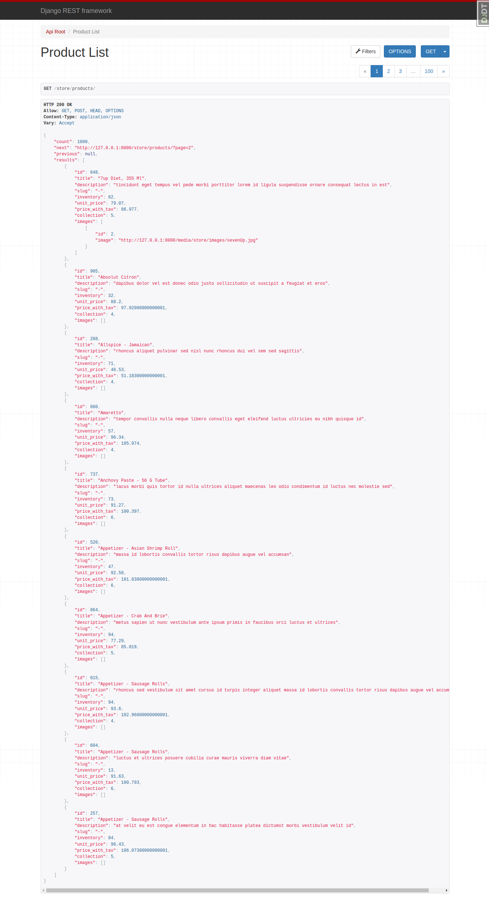

# e-commerce

A complete e-commerce solution with a customized admin interface.

## Technologies

- django 4.0: web framework
- django rest framework: API
- mysql: database
- celery: background tasks
- redis: message broker for celery and caching
- jwt: authentication
- djoser: custom user model
- uuid: UUID for cart objects
- locust: performance testing
- flower: celery monitoring tool
- whitenoise: serving static assets
- debug_toolbar: debugging
- logging: logging to file and console
- model_bakery: fixtures for testing
- pytest: automated testing
- smtp4dev: email server for dev and testing
- gunicorn: production server
- djecrety: secret key generator
- dj-database-url: database config in prod
- docker: containerization of the app

## Development tips

- pylint-django  
install the package:  
pip (or pipenv) install pylint-django   
create this file (doesn't have an extension) in the root of the project:  
.pylintrc  
type the following command in the created file:  
load-plugins=pylint-django  

- requirements.txt  
create the file and write the packages in it:  
pip freeze > requirements.txt  
install the packages (after cloning for instance a project on GitHub):  
pip install -r requirements.txt  

- MRO (Method Resolution Order) in inheritance  
e.g. see django-mdn project  
class AuthorCreate(CreateView, PermissionRequiredMixin): -> permission not applied  
class AuthorCreate(PermissionRequiredMixin, CreateView): -> permission applied  

##  Products - Admin

##  Product Item - Admin

##  Products - API

## Locust

